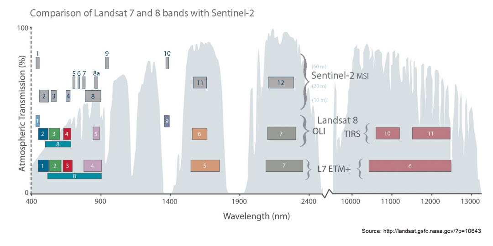

<style type="text/css">
body {max-width: none;}
a:visited {color: #91170a;}
</style>

# [WUR Geoscripting](https://geoscripting-wur.github.io/) 

```{r, echo=FALSE, message=FALSE}
library(knitr)
opts_chunk$set(fig.width=5, fig.align='center', fig.height=5, dpi=72)
```
<!--
# Today's items


Good morning!
Here is what you will do today:

Time  | Activity
------------- | -------------
Until 11:00 |  	Review answer of the other team for yesterday’s exercise
Morning  |  Self-study: go through the following tutorial
14:00 to 14:40  | Presentation and discussion
Rest of the afternoon | Do/finalise the exercise.
-->

# Week 2, Lesson 6: Advanced Raster Analysis

## Learning outcomes of today:

Being able to:

  - carry out a supervised classification on a series of raster layers
  - construct a raster sieve using the `clump()` function
  - deal with thematic (categorical maps)

# Advanced Raster Analysis

## Introduction to Sentinel-2 data used here

We will carry out a supervised classification using Sentinel 2 data for Gewata region in Ethiopia. Athmospherically corrected Level 2A data acquired on December 27 2020 used in this excercise. The data is download from ESA's online data hub (https://scihub.copernicus.eu/dhus), a part of the Copernicus European Programme. As it is freely available, Sentinel data has been commonly used next to Landsat data for environmental monitoring.


## Data exploration

Download the data to your computer and open your preferred R IDE to the directory of this tutorial.

After downloading the data we begin with vizualization. The data consists of all the Sentinel 2 bands at a spatial resolution of 20 m. We will also make use of training polygons for the land cover classification. 

We will be making use of the [RasterBrick](https://www.rdocumentation.org/packages/raster/versions/3.4-5/topics/brick) object.

```{r, message=FALSE, include=TRUE, results='hide', warning=FALSE}
# check for packages and install if missing
if(!"raster" %in% rownames(installed.packages())){install.packages("raster")}
if(!"rgdal" %in% rownames(installed.packages())){install.packages("rgdal")}
if(!"sf" %in% rownames(installed.packages())){install.packages("sf")}
if(!"ranger" %in% rownames(installed.packages())){install.packages("ranger")}

library(raster)
library(rgdal)
library(sf)

## Download data
if (!dir.exists("data"))
    dir.create("data")
download.file("https://github.com/GeoScripting-WUR/AdvancedRasterAnalysis/releases/download/advrast-data/AdvancedRaster.zip", "data/AdvancedRaster.zip")
unzip("data/AdvancedRaster.zip", exdir="data")

## Load data
Gewata<-brick("data/S2B2A_T36NZP_20201227T075239_20m_gewata_crop.tif")
names(Gewata)<-readLines("data/S2B2A_T36NZP_20201227T075239_20m_gewata_bands.txt")
# The image is cloud-free, so drop the cloud mask layer
Gewata<-dropLayer(Gewata, "SCL")
## Check out the attributes
Gewata$B02
## Some basic statistics using cellStats() from the raster package
cellStats(Gewata$B02, stat=max)
cellStats(Gewata$B02, stat=mean)
# This is equivalent to:
maxValue(Gewata$B02)
## What is the maximum value of all three bands?
max(c(maxValue(Gewata$B02), maxValue(Gewata$B8A), maxValue(Gewata$B11)))
## summary() is useful function for a quick overview
summary(Gewata$B02)
```

You might get different values for cellStats an maxValue, the reason for this is that the cellStats looks at all the pixel values whereas the maxValue function takes a subset of the pixel values. As a result maxValue is faster than cellStats. 


``` {r, message=FALSE, include=TRUE, results='hide', warning=FALSE}
# histograms for all the bands in one window (automatic, if a RasterBrick is supplied)
hist(Gewata, maxpixels=1000)
```

Note that the values of these bands have been rescaled by a factor of 10,000. This is done for file storage considerations. For example, a value of 0.5643 stored as a float takes up more disk space than a value of 5643 stored as an integer. If you prefer reflectance values in their original scale (from 0 to 1), this can easily be done using raster algebra or `calc()`. We will do this later.

A scatterplot matrix can be helpful in exploring relationships between raster layers. This can be done with the `pairs()` function of the raster package, which (like `hist()`) is a wrapper for the same function found in the `graphics` packages.

```{r, fig.width=12, fig.height=10}
pairs(Gewata, maxpixels=1000)
```

Note that both `hist()` and `pairs()` compute histograms and scatterplots based on a random sample of raster pixels. The size of this sample can be changed with the argument `maxpixels` in either function.

Calling `pairs()` on a `RasterBrick` reveals potential correlations between the layers themselves. In the case of bands of the Gewata subset, we can see that band 3 and 5 (in the visual part of the EM spectrum) and bands 6 and 7 (in the near infrared part of the EM spectrum) are highly correlated. Similar correlation also exist between band 11 and 12. While band 8a contains significant non-redundant information.

```{block, type="alert alert-success"}
> **Question 1**: Given what we know about the location of these bands along the EM spectrum, how could these scatterplots be explained?
```

In the previous lesson, we explored several ways to calculate NDVI, using direct raster algebra, `calc()` or `overlay()`. Since we will be using NDVI again later in this tutorial, let's calculate it again and store it in our workspace using `overlay()`.

```{r}
par(mfrow = c(1, 1)) # reset plotting window
ndvi <- overlay(Gewata$B8A, Gewata$B04, fun=function(x,y){(x-y)/(x+y)})
plot(ndvi)
```

Aside from the advantages of `calc()` and `overlay()` regarding memory usage, an additional advantage of these functions is the fact that the result can be written immediately to the file by including the `filename = "..."` argument, which will allow you to write your results to file immediately, after which you can reload in subsequent sessions without having to repeat your analysis.

```{block, type="alert alert-success"}
> **Question 2**: What is the advantage of including the NDVI layer in the classification?
```

## Classifying raster data

One of the most important tasks in analysis of remote sensing image analysis is image classification. In classifying the image, we take the information contained in the various bands (possibly including other synthetic bands such as NDVI or principal components). There are two approaches for image classification: supervised and unsupervised. In this tutorial we will explore supervised classification based on the Random Forest method.


### Supervised classification: Random Forest

The Random Forest classification algorithm is an ensemble learning method that is used for both classification and regression. In our case, we will use the method for classification purposes. Here, the Random Forest method takes random subsets from a training dataset and constructs classification trees using each of these subsets. Trees consist of *branches* and *leaves*.

Branches represent nodes of the decision trees, which are often thresholds defined for the measured (known) variables in the dataset. Leaves are the class labels assigned at the termini of the trees. Sampling many subsets at random will result in many trees being built. Classes are then assigned based on classes assigned by all of these trees based on a majority rule, as if each class assigned by a decision tree were considered to be a *vote*.

The figure below gives a simple demonstration of how the random forest method works in principle. For an introduction to the Random Forest algorithm, see this [presentation](http://www.slideshare.net/0xdata/jan-vitek-distributedrandomforest522013). For more information on random forest implementation in R see this [tutorial](https://uc-r.github.io/random_forests).

<!--
```{r random, echo=FALSE, fig.cap='Schematic showing how the Random Forest method constructs classification trees from random subsets of a training dataset. Each tree determines the labels assigned based on the training dataset. Once all trees are assembled, classes are assigned to unknown pixels based on the class which receives the majority of votes based on all the decision trees constructed.'}
library(png)
library(grid)
img <- readPNG("figs//randomForestDescription.png")
grid.raster(img)
```
-->


One major advantage of the Random Forest method is the fact that an *Out Of the Bag* (OOB) cross-validation error estimate and an estimate of variable performance are performed. For each classification tree assembled, a fraction of the training data are left out and used to compute the error for each tree by predicting the class associated with that value and comparing with the already known class. This process results in a confusion matrix, which we will explore in our analysis. In addition an importance score is computed for each variable in two forms: the mean decrease in accuracy for each variable, and the Gini impurity criterion, which will also be explored in our analysis.

To perform the classification in R, it is best to assemble all covariate layers (ie. those layers contaning predictor variable values) into one `RasterBrick` object. In this case, we can simply append the new layer (NDVI) to our existing `RasterBrick` (currently consisting of different bands).

First, let's rescale the original reflectance values to their original scale. This step is not required for the RF classification, but it might help with the interpretation, if you are used to thinking of reflectance as a value between 0 and 1. (On the other hand, for very large raster bricks, it might be preferable to leave them in their integer scale, but we won't go into more detail about that here.)

```{r, eval=TRUE, fig.align='center', fig.show='hide'}
gewata <- calc(Gewata, fun=function(x) x / 10000)
## Make a new RasterStack of covariates by 'stacking' together the existing gewata brick and NDVI
covs <- stack(gewata, ndvi)
plot(covs)
```

You'll notice that we didn't give our NDVI layer a name yet. It's good to make sure that the raster layer names make sense, so you don't forget which band is which later on. Let's change all the layer names (**make sure you get the order right!**).

```{r}
names(covs) <- c(names(Gewata),"NDVI")
names(covs)
```

### Training data preparation
For this exercise, we will do a very simple classification for 2020 using three classes: forest, cropland and wetland. While for other purposes it is usually better to define more classes (and possibly fuse classes later), a simple classification like this one could be useful, for example, to construct a forest mask for the year 2020

```{r, fig.align='center', fig.width=5, warning=FALSE}
download.file("https://github.com/GeoScripting-WUR/AdvancedRasterAnalysis/raw/gh-pages/data/trainingPoly.csv", "data/trainingPoly.csv")
## we load the training polygons as a csv file using st_read:
trainingPoly <- st_read("data/trainingPoly.csv")
## Superimpose training polygons onto NDVI plot
par(mfrow = c(1, 1)) # reset plotting window
plot(ndvi)
plot(trainingPoly, add = TRUE)
```

The training classes are labelled as string labels. For this exercise, we will need to work with integer classes, so we will need to first 'relabel' our training classes. There are several approaches that could be used to convert these classes to integer codes. In this case, we will first make a function that will reclassify the character strings representing land cover classes into integers based on the existing factor levels.

```{r reclassify}
## Inspect the trainingPoly object
trainingPoly<-trainingPoly[,c(2:4)] #remove an unused column
trainingPoly

# The 'Class' column is a character but should be converted to factor 
summary(trainingPoly$Class)
trainingPoly$Class <- as.factor(trainingPoly$Class)
summary(trainingPoly$Class)

```

```{r}
# We can make a new 'Code' column by converting the factor levels to integer by using the as.numeric() function,
trainingPoly$Code <- as.numeric(trainingPoly$Class)
# Inspect the new 'Code' column
summary(trainingPoly$Code)
```

```{r}
## Plotting
# Define a colour scale for the classes (as above)
# corresponding to: cropland, forest, wetland
cols <- c("orange", "dark green", "light blue")
### Superimpose training polygons (colour by class) onto NDVI plot
plot(ndvi)
plot(trainingPoly["Class"], add = TRUE, pal=cols)
## Add a customised legend
legend("topright", legend=c("cropland", "forest", "wetland"), fill=cols, bg="white")
```


Our goal in preprocessing this data is to have a table of values representing all layers (covariates) with *known* values/classes. To do this, we will first need to know the values of the covariates at our training polygon locations. We can use `extract` function of raster package for this. Next we convert these data to a `data.frame` representing all training data.

```{r include=TRUE, results='hide'}
## Extract pixel values below the polygons
trainingData<-extract(covs, trainingPoly)
# Check structure
str(trainingData)
# It is a matrix (rows are pixels, columns are bands) per polygon
# Convert each matrix to a data.frame and add the class column from the polygons
valuetable <- lapply(1:length(trainingData), function(polygonID) cbind.data.frame(trainingData[[polygonID]], Class=trainingPoly$Class[polygonID]))
# Unlist into one long data.frame
valuetable <- do.call(rbind, valuetable)

```

This data.frame will be used as an input into the RandomForest classification function. We then inspect the first and last 10 rows.

```{r}

head(valuetable, n = 10)
tail(valuetable, n = 10)
```

We have our training dataset as a `data.frame` with the class column as a factor. If it is integer, random forest regression will be run, instead of classification. So, good to check on that. 

Now we have a convenient training data table which contains, for each of the three defined classes, values for all covariates. Let's visualize the distribution of some of these covariates for each class. To make this easier, we will create 3 different data.frames for each of the classes. This is just for plotting purposes, and we will not use these in the actual classification.

```{r, eval=TRUE, fig.width=12, fig.height=15}
val_crop <- subset(valuetable, Class == "cropland")
val_forest <- subset(valuetable, Class == "forest")
val_wetland <- subset(valuetable, Class == "wetland")

## NDVI
par(mfrow = c(3, 1))
hist(val_crop$NDVI, main = "cropland", xlab = "NDVI", xlim = c(0, 1), col = "orange")
hist(val_forest$NDVI, main = "forest", xlab = "NDVI", xlim = c(0, 1),  col = "dark green")
hist(val_wetland$NDVI, main = "wetland", xlab = "NDVI", xlim = c(0, 1), col = "light blue")
par(mfrow = c(1, 1))
```

> Other covariates such as the bands can also be plotted like above.

```{r, eval=TRUE, fig.width=10, fig.height=6}
## 3. Bands 8a and 11 (scatterplots)
plot(B8A ~ B11, data = val_crop, pch = ".", col = "orange", xlim = c(0, 0.4), ylim = c(0, 0.5))
points(B8A ~ B11, data = val_forest, pch = ".", col = "dark green")
points(B8A ~ B11, data = val_wetland, pch = ".", col = "light blue")
legend("topright", legend=c("cropland", "forest", "wetland"), fill=c("orange", "dark green", "light blue"), bg="white")
```

```{block, type="alert alert-success"}
> **Question 3**: Try to produce the same scatterplot plot as above looking at the relationship between other bands. Try B02 & B05, B07 & NDVI (you might have adjust the xlim to incorporate the NDVI values) and another of your choice. What can you say about the relationships between these bands? Which ones give a clear distinction between classes, and where is this less clear?
```


We can see from these distributions that these covariates may do well in classifying forest pixels, but we may expect some confusion between cropland and wetland (although the individual bands may help to separate these classes). You can save the training data using the `write.csv()` command, in case something goes wrong after this point and you need to start over again.

### Run Random Forest classification
We build the Random Forest model using the training data. For this, we will use the `ranger` package in R. There is also `randomForest` package available in R. However, `ranger` is is implemented in C++ with multithreading and thus is much faster. 
Using the `ranger()` function, we will build a model based on a matrix of predictors or covariates (ie. the first 10 columns of valuetable) related to the response (the `Class` column of valuetable).

### Construct a random forest model. 

Covariates (x) are found in columns 1 to 10 of valuetable. Training classes (y) are found in the 'class' column of valuetable. *Caution: this step takes fairly long!* but can be shortened by setting importance=FALSE

```{r, eval=FALSE}

library(ranger)
modelRF <- ranger(x=valuetable[, 1:ncol(valuetable)-1], y=valuetable$Class,
                  importance = "permutation", seed=0xfedbeef)
```

```{r, echo=FALSE, results='hide'}
library(ranger)
if(!file.exists("data/modelRF.rda")){
 modelRF <- ranger(x=valuetable[, 1:ncol(valuetable)-1], 
                                y=valuetable$Class,
                                importance = "permutation", seed=0xfedbeef)
  save(modelRF, file='data/modelRF.rda', compress="bzip2", ascii=FALSE)
} else {
  load('data/modelRF.rda')
}
```

Since the random forest method involves the building and testing of many classification trees (the 'forest'), it is a computationally expensive step (and could take a lot of memory for especially large training datasets). When this step is finished, it would be a good idea to save the resulting object with the `saveRDS()` command. Any R object can be saved as an `.rds` file and reloaded into future sessions using `readRDS()`.

```{block, type="alert alert-info"}
**Note**: there is a similar functionality using the `save()` and `load()` commands, but those can save more than one object and don't tell you their names, you have to know them. That is why `saveRDS()`/`readRDS()` is preferred, but in this tutorial in a lot of cases `load` is still being used.
```

The resulting object from the `ranger()` function is a specialized object of class `ranger`, which is a large list-type object packed full of information about the model output. Elements of this object can be called and inspected like any list object.

```{r, results='hide', eval=FALSE}
## Inspect the structure and element names of the resulting model
modelRF
class(modelRF)
str(modelRF)
names(modelRF)
## Inspect the confusion matrix of the OOB error assessment
modelRF$confusion.matrix

```

Earlier we provided a brief explanation of OOB error, though it can be a valuable metric for evaluating your model, it can overestimate the true prediction error depending on the parameters presents in the model.

Since we set `importance="permutation"`, we now also have information on the statistical importance of each of our covariates which we can retrieve using the `importance()` command.

```{r importance}
importance(modelRF)
```
The  above shows the variable importance for a Random Forest model showing the mean decrease in accuracy for each variable.

The mean decrease in accuracy indicates the amount by which the classification accuracy decreased based on the `OOB` assessment. In this case, it seems that Gewata bands 12 and 2 have the highest impact on accuracy. For large datasets, it may be helpful to know this information, and leave out less important variables for subsequent runs of the `ranger()` function.

Since the NDVI layer scores relatively low according to the mean accuracy decrease criterion, try to construct an alternate Random Forest model as above, but excluding this layer, you can name it something like 'modelRF2'.

```{block, type="alert alert-success"}
> **Question 4**:  What effect does this have on the overall accuracy of the results (hint: compare the confusion matrices of the original and new outputs). What effect does leaving this variable out have on the processing time (hint: use `system.time()`)?
```

Now we apply this model to the rest of the image and assign classes to all pixels. Note that for this step, the names of the raster layers in the input brick (here `covs`) must correspond exactly to the column names of the training table. We will use the `predict()` function from the `raster` package. This function uses a pre-defined model to predict values of raster cells based on other raster layers. This model can be derived by a linear regression, for example. In our case, we will use the model provided by the `ranger()` function.

```{r, echo=FALSE, results='hide'}
if (!file.exists(fn <- "data/predLC.grd")) {
  predLC <-raster::predict(covs, modelRF, fun=function(...) predict(...)$predictions, filename = fn)
} else {
  predLC <- raster(fn)
}
```


```{r}
## Double-check layer and column names to make sure they match
names(covs)
names(valuetable)
```

```{r, eval=FALSE}
## Predict land cover using the RF model
predLC <-raster::predict(covs, modelRF, fun=function(...) predict(...)$predictions)
```

```{r, fig.width=7}
## Plot the results
# recall: 1 = cropland, 2 = forest, 3 = wetland
cols <- c("orange", "dark green", "light blue")
plot(predLC, col=cols, legend=FALSE)
legend("bottomright",
       legend=c("cropland", "forest", "wetland"),
       fill=cols, bg="white")
```

Note that the `predict()` function also takes arguments that can be passed to `writeRaster()` (eg. `filename = ""`, so it is a good idea to write to file as you perform this step (rather than keeping all output in memory).

## Applying a raster sieve by clumping

Although the land cover raster resulted from the Random Forest has limited number of thematic classes, and we observed some confusion between wetland and cropland classes, it could be useful for constructing a forest mask (since that class performed quite well). To do so, we have to fuse (and remove) non-forest classes, and then clean up the remaining pixels by applying a sieve. We will make use of the `clump()` function (detecting patches of connected cells) in the raster package.


```{r, include=TRUE, fig.lp="Application of a sieve on a forest mask. In the Queen's case, neighbours in all 8 directions are considered to be adjacent. In the Rook's case, only neighbours in the 4 NESW directions are considered adjacent, and diagonal neighbours are not considered."}

## Make an NA-value raster based on the LC raster attributes
formask <- setValues(raster(predLC), NA)
## Assign 1 to formask to all cells corresponding to the forest class
formask[predLC==2] <- 1
plot(formask, col="dark green", legend = FALSE)
```

The forest mask here can be used to isolate forest pixels for further analysis. Forest pixels (from the Random Forest classification) have a value of 1, and non-forest pixels have a value of `NA`.

For some applications, we may only be interested in larger forest areas. We may especially want to remove single forest pixels, as they may be a result of errors, or may not fit our definition of *forest*.

In this section, we will construct 2 types of sieves to remove these types of pixels, following 2 definitions of *adjacency*. In the first approach, the so-called *Queen's Case*, neighbours in all 8 directions are considered to be adjacent. If any pixel cell has no neighbours in any of these 8 directions, we will remove that pixel by assigning an `NA` value.

First, we will use the `clump()` function in the raster package to identify clumps of raster cells.
This function arbitrarily assigns an ID to these clumps.

```{r, results='hide', fig.show='hide'}
## The igraph package is needed for the clump function
if(!"igraph" %in% rownames(installed.packages())){install.packages("igraph")}
library(igraph)

## Group raster cells into clumps based on the Queen's Case
if(!file.exists(fn <- "data/clumformask.grd")) {
  forestclumps <- clump(formask, directions=8, filename=fn)
} else {
  forestclumps <- raster(fn)
}
plot(forestclumps, col=topo.colors(nrow(forestclumps)))
```

When we inspect the frequency table with `freq()`, we can see the number of raster cells included in each of these clump IDs.

```{r, fig.show='hide', results='hide'}
## Assign freqency table to a matrix
clumpFreq <- freq(forestclumps)
head(clumpFreq)
tail(clumpFreq)
```

We can use the `count` column of this frequency table to select clump `ID`s with only 1 pixel - these are the pixel "islands" that we want to remove from our original forest mask.

```{r, results='hide', fig.lp="Zoom of a forest mask before (left) and after (right) application of a sieve using the Queen's Case condition.", fig.width=10, dpi=72}
## Coerce freq table to data.frame
clumpFreq <- as.data.frame(clumpFreq)
## which rows of the data.frame are only represented by one cell?
str(which(clumpFreq$count==1))
## which values do these correspond to?
str(clumpFreq$value[which(clumpFreq$count==1)])
## Put these into a vector of clump ID's to be removed
excludeID <- clumpFreq$value[which(clumpFreq$count==1)]
## Make a new forest mask to be sieved
formaskSieve <- formask
## Assign NA to all clumps whose IDs are found in excludeID
formaskSieve[forestclumps %in% excludeID] <- NA
## Zoom in to a small extent to check the results
# Note: you can define your own zoom by using e <- drawExtent()
e <- extent(c(811744.8, 812764.3, 849997.8, 850920.3))
opar <- par(mfrow=c(1, 2)) # allow 2 plots side-by-side
par(opar)
plot(formask, ext=e, col="dark green", legend=FALSE, main='formask')
plot(formaskSieve, ext=e, col="dark green", legend=FALSE, main='formaskSieve')
par(mfrow = c(1, 1)) # reset plotting window
```

We have successfully removed all *island* pixels from the forest mask using the `clump()` function. We can adjust our sieve criteria to only directly adjacent (NESW) neighbours: the so-called *Rook's Case*. To accomplish this, simply repeat the code above, but supply the argument `directions=4` when calling `clump()`.

```{r, eval=FALSE, echo=FALSE, results='hide', include=FALSE}
## Check for igraph package and install if missing
if(!"igraph" %in% rownames(installed.packages())){install.packages("igraph")}
library(igraph)

## Group raster cells into clumps based on the Queen's Case
?clump
forestclumps <- clump(formask, directions=4)
clumpFreq <- freq(forestclumps)
## Coerce freq table to data.frame
clumpFreq <- as.data.frame(clumpFreq)
excludeID <- clumpFreq$value[which(clumpFreq$count==1)]
## make a new forest mask to be sieved
formaskSieve <- formask
## assign NA to all clumps whose IDs are found in excludeID
formaskSieve[forestclumps %in% excludeID] <- NA
e <- extent(c(811744.8, 812764.3, 849997.8, 850920.3))
opar <- par(mfrow = c(1, 2))
plot(formask, ext=e, col="dark green", legend=FALSE, main='formask')
plot(formaskSieve, ext=e, col="dark green", legend=FALSE, main='formaskSieve')
par(opar)
```

We could take this approach further and apply a minimum mapping unit (MMU) to our forest mask.

```{block, type="alert alert-success"}
> **Question 5:** How could you adjust the above sieve to remove all forest pixels with area below 0.5 hectares? Consider the fact that Landsat pixels are 30m by 30m, and that one hectare is equal to 10000m<sup>2</sup>.
```

## Working with thematic rasters

As we have seen with the land cover rasters we derived using the random forest above, the values of a raster may be categorical, meaning they relate to a thematic class (e.g. 'forest' or 'wetland') rather than a quantitative value (e.g. NDVI or % Tree Cover). The raster dataset 'lulcGewata' is a raster with integer values representing Land Use and Land Cover (LULC) classes from a 2011 classification (using SPOT5 and ASTER source data).

```{r}
download.file("https://github.com/GeoScripting-WUR/AdvancedRasterAnalysis/releases/download/thematic-data/lulcGewata.zip", "data/lulcGewata.zip")
unzip("data/lulcGewata.zip", exdir="data")
lulcGewata <- raster("data/lulcGewata.tif")
## Check out the distribution of the values
freq(lulcGewata)
hist(lulcGewata)
```

This is a raster with integer values between 1 and 6, but for this raster to be meaningful at all, we need a lookup table (LUT) to identify these classes. A `data.frame` defining these classes is also included in the lesson repository:

```{r}
LUTGewata <- read.csv("data/LUTGewata.csv")
LUTGewata[[1]] <- NULL # Remove the name column
LUTGewata
```

This `data.frame` represents a lookup table for the raster we just loaded. The `$ID` column corresponds to the values taken on by the `lulc` raster, and the `$Class` column describes the LULC classes assigned. In `R` it is possible to add an attribute table to a raster. In order to do this, we need to coerce the raster values to a factor from an integer and add a raster attribute table.

```{r}
lulc <- as.factor(lulcGewata)
# assign a raster attribute table (RAT)
levels(lulc) <- LUTGewata
lulc
```

In some cases it might be more useful to visualize only one class at a time. The `layerize()` function in the raster package does this by producing a `RasterBrick` object with each layer representing the class membership of each class as a boolean.

```{r, eval=TRUE, fig.show='hide'}
classes <- layerize(lulc)
# Layer names follow the order of classes in the LUT
names(classes) <- LUTGewata$Class
plot(classes, legend=FALSE)
```

Now each class is represented by a separate layer representing class membership of each pixel with 0's and 1's. If we want to construct a forest mask as we did above, this is easily done by extracting the fifth layer of this `RasterBrick` and replacing 0's with NA's.

```{r}
forest <- raster(classes, 5)
# is equivalent to:
forest <- classes[[5]]
# or (since the layers are named):
forest <- classes$forest
## Replace 0's (non-forest) with NA's
forest[forest==0] <- NA
plot(forest, col="dark green", legend=FALSE)
```

# Today's summary

We learned about:

- Dealing with Landsat data
- How to:    
    - perform a supervised classification using R scripts
    - clump and sieve connected cells within a raster
    - deal with thematic (i.e. categorical raster data) by assigning raster attribute tables.

<!--

# Exercise 09 : Advanced Raster Analysis

## Description of the excercise
Today we learned about how a `model` object in R can be used to predict raster values. This is a good example of how we can use the strengths of R's statistical packages in a spatial context. Of course, there are many more types of `model` objects than what is returned by `randomForest()`. The most basic `model` object is a product of a linear regression returned by `lm()`.

The VCF Tree Cover product that we used in the random forest classification is a product of a spatial model of tree cover, based on several input data sources.

**Question**: Using Landsat band reflectance from **one** point in time, how well can we predict tree cover, using the existing VCF product as a response variable?


To answer this question:
Create a model object using `lm()` using Landsat band reflectance values as predictors for tree cover (VCF). You can build a `lm()` model in the same way as you build the randomForest model in
 [VectorRaster lesson](http://geoscripting-wur.github.io/VectorRaster/).Using the resulting `model` object, predict VCF values for the Gewata area.

See here for more info about `summary()` of the `lm` model:

- [link](http://www.r-tutor.com/elementary-statistics/simple-linear-regression/coefficient-determination)
- [also here](http://stats.stackexchange.com/questions/5135/interpretation-of-rs-lm-output)


## Link to data
The remaining Landsat bands for the Gewata area are in the data folder. You can also download the data from this [zip file](https://github.com/GeoScripting-WUR/AdvancedRasterAnalysis/raw/gh-pages/data/GewataBands.zip).

## Hints

**Hint1: loading the data **
```{r, results='hide', eval=FALSE}
load("data/GewataB1.rda")
load("data/GewataB5.rda")
load("data/GewataB7.rda")
## Band 6 (thermal infra-red) will be excluded from this exercise
## Build a brick containing all data
alldata <- brick(GewataB1, GewataB2, GewataB3, GewataB4, GewataB5, GewataB7, vcfGewata)
names(alldata) <- c("band1", "band2", "band3", "band4", "band5", "band7", "VCF")
```

**Hint2: Selecting training sample points **

```{r, eval=FALSE}
## Find borders of Gewate region
eth <- getData('GADM', country='ETH', level=3)
gwt <- eth[eth$NAME_3=="Getawa",]
gwt <- spTransform(gwt, CRSobj = crs(vcfGewata))

#apply the mask to all data
alldata <- mask(x = alldata, mask=gwt)
plotRGB(alldata, 3, 2, 1, stretch="lin", main = "RGB image of the Gewata region")

## Extract all data to a data.frame
df <- as.data.frame(getValues(alldata))

## select random sample points (choose a size what you think is proper)
## and use as training data
sRandomGWT <- sampleRandom(alldata, na.rm=TRUE, sp=TRUE, size = 1000)
sRandomData <- data.frame(VCF = sRandomGWT@data[[7]],
                          band1 = sRandomGWT@data[[1]],
                          band2 = sRandomGWT@data[[2]],
                          band3 = sRandomGWT@data[[3]],
                          band4 = sRandomGWT@data[[4]],
                          band5 = sRandomGWT@data[[5]],
                          band7 = sRandomGWT@data[[6]],
                          latitude = sRandomGWT@coords[,'y'],
                          longitude = sRandomGWT@coords[,'x'])
plot(gwt, main="The randomly selected sampling points")
plot(sRandomGWT, add = TRUE, col = "red")
```

## Assessment

The general rubrics will be used for the assessment of your script. These can be found on the BlackBoard. The three specific tasks in the rubrics your script will be assessed on are:

**Task1 ** Produce one or more plots that demonstrate the relationship between the Landsat bands and the VCF tree cover. What can you conclude from this/these plot(s)? Based on the correlation, select suitable variables for the regression model.

**Task2 ** Compare the predicted tree cover raster with the original VCF raster by  (1) plotting them and (2) by making a difference raster and plotting it

**Task3 ** Compute the RMSE between your predicted and the original tree cover values ([hint](http://stackoverflow.com/questions/17703037/how-to-perform-rmse-in-r))

**Bonus: ** You can earn the bonus point if you answer the following question:

- Are the differences between the predicted and original tree cover the same for all of the 3 classes we used for the Random Forest classification? Using the training polygons from the random forest classification, calculate the RMSE separately for each of the classes and compare. *Hint* - see `?zonal()`.

## Submission

Make sure your script is clear and reproducible. Make a new GitLab project and upload the script there according to the guidelines on BlackBoard. Review the script of another team (see the random team selector Shiny app) tomorrow morning and add an issue t their project with your feedback.
Do not forget to add your teamname, members and date at the top of your script.
-->

# More information

- [Random Forest Classification: R versus Python!](http://blog.yhathq.com/posts/comparing-random-forests-in-python-and-r.html)
- [All the Rstudio documentation](https://support.rstudio.com/hc/en-us/categories/200035113-Documentation)
